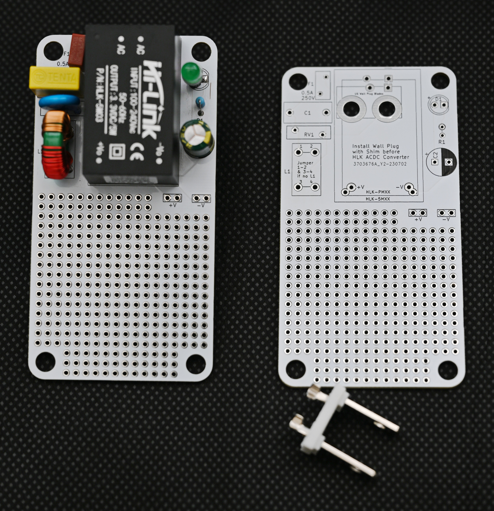

# AC Wall Adapter PCB for IoT
An AC wall adapter PCB to power &amp; consolidate your IoT & DIY project into a single housing without resorting to an ugly USB phone charger
 

 

## Bill of Materials

Required components:
- Qty 1 - AC Wall Adapter PC Board - [order from here](https://www.tindie.com/products/shencentral/ac-wall-adapter-pcb-for-iot-projects-us-plug/)
- Qty 1 - US AC two-prong plug (included with PCB order)
- Qty 1 - F1 - Miniature PCB Fuse 0.5A, 250V slow blow - rectangular or TR5/5TR style (ex. Littlefuse 37205000001)
- Qty 1 - AC-DC Converter module - Hi-Link HLK PMXX or 5MXX series
- Qty 1 - 3D printed enclosure - see link below

  
Optional components for EMI suppression, surge protection, & power indication:
- Qty 1 - RV1 - Varistor 10D561K (ex. Bourns MOV-10D561K)
- Qty 1 - L1 - Common mode choke inductor 10mH or 15mH, 500mA min, 270V (ex. Wurth 74482111)
- Qty 1 - C1 - 0.1uF, 275VAC polypropylene capacitor (ex. MEX/TENTA 275V104P10)
- Qty 1 - C2 - 220uF, 35V capacitor
- Qty 1 - D1 - LED
- Qty 1 - R1 - Resistor, use value suitable for +Vout & LED

 

## Printed Circuit Board

The main component of the PCB is the Hi-Link AC-DC converter.  The PCB is designed to accommodate either the HLK-PMxx or the HLK-5Mxx series component footprint.  They are available in several voltages.  You can find them on Amazon, AliExpress, and other sources.

The PCB footprint for the fuse accommodates a miniature PCB fuse.  They are again available from Amazon or Aliexpress and other sources.  The PCB silkscreen indicates a rectangular footprint shape for the fuse, but the radial (TR5/5TR) style will also fit.  (Search for "pcb fuse 0.5a 250v TR5")

The PCB has provisions for optional EMI suppression, surge protection, and power indication components.  The Hi-Link AC-DC adapter will work without these components, obviously without the benefits they provide.  Be sure to install jumpers if the common mode inductor (see L1 on PCB) is not installed.

The prototyping grid accommodates most ESP8266 & ESP32 "development boards" with some modest space leftover for sensor or connector attachment.  If additional room is needed, you can use the room to attach a header for piggybacking another prototyping PCB above.  The 3D printed case can be modified using Fusion360 for height.  Just be sure not to smother your WiFi signal by being too dense near it.

Schematic and layout [here](https://github.com/heyitsyang/AC-Wall-Adapter-PCB/tree/main/Schematic_and_Layout)

 

## 3D Printed Enclosure

STL mesh files and the Fusion360 design file are provided.  The Fusion360 design file is parametric in X,Y & Z directions, so you can expand for additional components if necessary.  When modifying the Fusion360 design to change dimensions, editing CAPITALIZED parameter values is safe/tested.  Editing other parameters may yield unexpected results.

Print the following:
- Enclosure top (choice of two styles)
- Enclosure bottom
- AC plug shim

Two options for the 3D printed enclosure are included:
- Flat top - normal enclosure with a flat top - better if you need side portals for connectors
- Tented top - top with angled sides for a slimmer look at the expense of potentially useful volume

One very important, but easily overlooked component that must be printed is the shim for the plug.  The shim is a plastic spacer that must be installed between the PCB and the plug before soldering the plug.  When populating the PCB, *the shim and AC plug must be installed before the Hi-Link AC-DC converter.*  

If you choose to design your own enclosure, the plug offset is the critical measurement that drives the design for the enclosure bottom.

Supports should not be necessary for printing.  Enclosure halves are fastened using #4 0.5 inch or M3 screws.

3D printing files [here](https://github.com/heyitsyang/AC-Wall-Adapter-PCB-for-IoT/tree/main/3D_Printed_Enclosure)

 

## Assembly

Most of the assembly is straightforward.  

Both the HiLink HLK-5Mxx and HLK-PMxx series AC-DC Converters are supported.  The footprints on the PCB are overlapping. just align to the correct one after you have installed the AC plug and shim assembly.

As mentioned above, do not overlook placing the shim on the AC plug prior to soldering. Orient the AC plug and shim assembly as shown in the photo - don't install the AC plug upside down.  Double check this step!

Shim placement

Correct AC plug orientation shown from front side of PCB

 

## Images

PCB & Plug

Finished Project with top options ready for your circuit!

